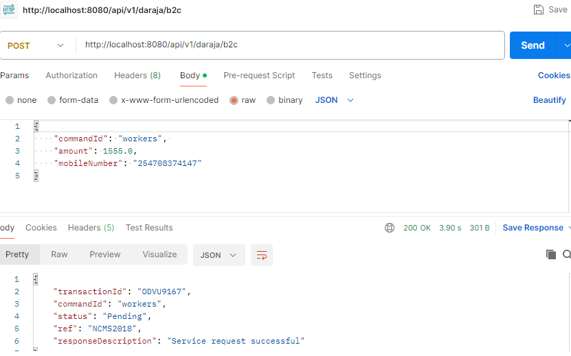
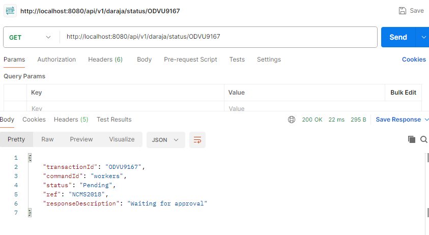
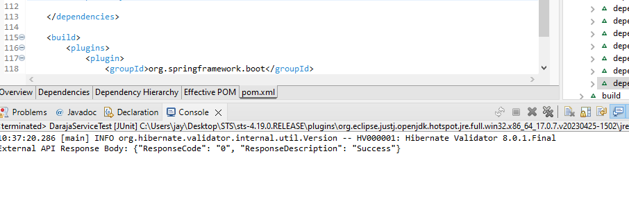

## B2C daraja API integration

Project Documentation: B2C Daraja Integration

1. Project Overview
   This project involves integrating Daraja B2C API with a Spring Boot application to handle payment requests. The system is designed using Docker to containerize the application components, including MongoDB, Kafka, and the Spring Boot application.

### The main objectives are:-

Integrate the Daraja B2C API for handling payment requests.
Set up a Spring Boot application with Kafka and MongoDB.
Containerize the application using Docker. 2. Architecture

### Components

Spring Boot Application: The main application that handles business logic and interacts with the Daraja B2C API.
MongoDB: Database for storing transaction data.
Kafka: Messaging system for processing and transmitting data.
Docker: Containerization platform to manage application deployment.

### Docker Compose Configuration

The docker-compose.yml file defines the services used in the project. The key services used here are:-
mongodb: Container for MongoDB.
kafka: Container for Kafka, dependent on Zookeeper.
zookeeper: Container for Zookeeper, required for Kafka.
springboot: Container for the Spring Boot application, dependent on MongoDB and Kafka.

+------------+ +----------+ +----------+
| MongoDB | | Kafka | | Zookeeper|
+------------+ +----------+ +----------+
| | |
| | |
| | |
+-------------------------------+
| Spring Boot |
| (Application) |
+-------------------------------+
|
|
+-----------------------+
| Daraja B2C API |
+-----------------------+

# application testing

Installation Steps
Clone the Repository
git clone https://github.com/omwanda98/B2Cdaraja.git
cd B2Cdaraja

### Build and Run Containers

docker-compose up --build

# payment status update

GwRequest and Result Response

with invalid data

check status

update status

tests

In conclusion, this project integrates Daraja B2C with a Spring Boot application using Docker to manage and deploy services. It provides a robust setup for handling payment requests through the Daraja API, with Kafka for messaging and MongoDB for data storage.
